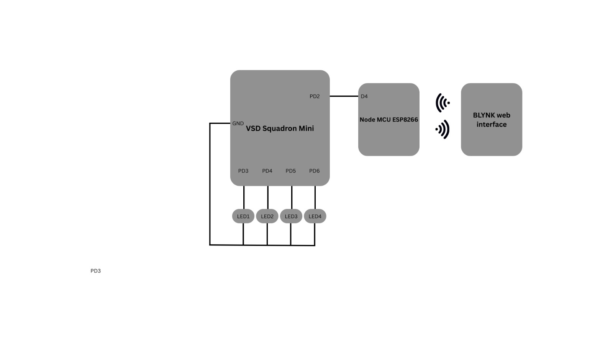

# Samsung RISC-V Project

## Basic Details
- **Name:** Jhanavi M
- **Email:** jhanavi.m2005@gmail.com
- **College:** Dayananda Sagar College Of Engineering

## RISC-V Mission 2025 | Empowering Semiconductor Innovation 🚀

Welcome to my GitHub repository! 🎉

This space is dedicated to showcasing my journey and learnings as part of the RISC-V Mission 2025 initiative, organized by Samsung Semiconductor India Research (SSIR) in collaboration with VLSI System Design (VSD).

---

## 🌟 About RISC-V Mission 2025

This mission is a nation-building initiative aimed at:

1. Creating a skilled workforce of 1,000 RISC-V engineers in Karnataka.
2. Empowering engineering students with hands-on training and real-world skills in semiconductor and RISC-V technologies.
3. Enabling innovation and strengthening India's position in the global semiconductor landscape.

---

## 🛠 My Journey

### 🚩 Workshop Overview

1. **6-Week Training Program:** Focused and practical, equipping participants with skills in RISC-V architecture and semiconductor technology.
2. **RISC-V Development Board:** Exclusive access to development boards provided by VSD.
3. **Remote Engagement:** Hands-on workshops conducted in Tier-2 and Tier-3 VTU colleges to make cutting-edge technology accessible to all.
4. **Structured Online Learning:** Continued learning via an intensive online course.

### 🎓 Key Learnings

1. **RISC-V Architecture:** Fundamental concepts, instruction sets, and practical implementation.
2. **Hardware-Software Co-Design:** Integrating software solutions with RISC-V hardware.
3. **VLSI Design Techniques:** Insights into the future of semiconductor technology.
4. **Hands-On Experience:** Real-world problem-solving with RISC-V boards and tools.

---

## Tasks Overview

### Task 1: GitHub Setup and RISC-V Toolchain Installation

**Achievements:**
- Successfully created the GitHub repository `samsung-riscv`.
- Installed the RISC-V toolchain using the provided VDI link.
- Understood program flow through detailed video walkthroughs.
- Executed C-based and RISC-V-based lab exercises on my machine.
- Captured and uploaded lab snapshots to the repository with clear descriptions.

---

### Task 2: SPIKE Simulation Review

**Achievements:**
- Reviewed the SPIKE Simulation process by analyzing the provided video.
- Documented key insights into how SPIKE simulates RISC-V programs, including instruction execution and debugging.
- Summarized the simulation workflow and uploaded the documentation to the GitHub repository.

---

### Task 3: RISC-V Instruction Decoding

**Achievements:**
- Thoroughly explored RISC-V software documentation to understand instruction types (R, I, S, B, U, J).
- Studied a sample GitHub repository to visually decode RISC-V instructions.
- Used `riscv-objdump` to extract assembly code from my application.
- Identified 15 unique RISC-V instructions and manually decoded their 32-bit binary representations.
- Compiled and uploaded a detailed document of these decoded instructions to the repository.

---

### Task 4: Functional Simulation of RISC-V Core

**Achievements:**
- Downloaded and configured the Verilog netlist and testbench files.
- Set up a simulation environment using iverilog and gtkwave.
- Successfully performed functional simulations of the RISC-V Core.
- Captured and analyzed waveform outputs to verify correct core functionality.
- Wrote and compiled a simple C program using RISC-V GCC with `-O1` and `-Ofast` optimization flags.
- Generated and compared object dumps for both optimization levels.
- Uploaded waveform snapshots, simulation results, and compiled code to the GitHub repository.

---

### Task 5: Project Documentation and Implementation

**Project Name:** Smart Home Automation using VSD Mini RISC-V and ESP8266

**Application Overview:**
The Smart Home Automation project integrates the VSD Squadron Mini RISC-V board with the ESP8266 Wi-Fi module to control LED bulbs remotely using the Blynk app. This system allows wireless control of home appliances by leveraging the RISC-V microcontroller for signal processing and the ESP8266 for internet connectivity, enabling seamless communication between hardware and the Blynk web interface.

**Achievements:**
- Implemented the Smart Home Automation system by connecting LEDs to the VSD Squadron Mini and interfacing it with the ESP8266 Wi-Fi module.
- Configured the Blynk app to communicate with the ESP8266 for real-time LED control.
- Developed a Circuit Connection section with a clear block diagram.
- Constructed a Pin Connections Table for wiring details:

| VSD Squadron Mini | Node MCU ESP8266 | LED         |
|------------------|-----------------|-------------|
| PD2              | D4              | -           |
| PD3              | -               | LED1 (+ve)  |
| PD4              | -               | LED2 (+ve)  |
| PD5              | -               | LED3 (+ve)  |
| PD6              | -               | LED4 (+ve)  |
| GND              | -               | LED1,2,3,4 (-ve) |

**Components Required:**

| Component              | Quantity |
|-----------------------|----------|
| VSD Squadron Mini     | 1        |
| Node MCU ESP8266      | 1        |
| LED                   | 4        |
| Jumper Wires          | 10       |
| Breadboard            | 1        |

**Circuit Connection:**
Below is the circuit connection diagram for the Smart Home Automation system:

---

### Task 6: Final Code Submission & Application Demo

**Achievements:**
- Uploaded the final, functional Smart Home Automation code to the GitHub repository.
- Recorded a comprehensive video demonstrating the real-time execution of the automation system, showing LED control through the Blynk app.
- Included a brief yet impactful summary of the project's practical implementation using RISC-V technology.
- Provided links to the source code and video demonstration in the repository for public access and collaboration.

---

## 🤝 Let's Collaborate!
I’m excited to connect with fellow innovators and engineers who share an interest in RISC-V and semiconductor technology. Feel free to explore my repository, share feedback, or collaborate on exciting projects.

Together, let’s shape the future of semiconductor technology! 🌍✨

---

## 📜 Acknowledgments

Special thanks to:

1. **Samsung Semiconductor India Research (SSIR)**
2. **VLSI System Design (VSD)**
3. **The RISC-V Mission 2025 Team** for their incredible support and this outstanding learning opportunity.

